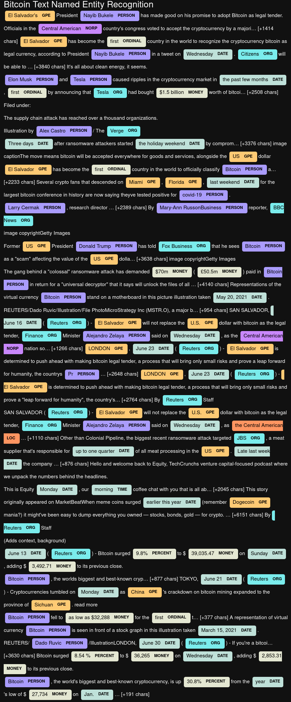
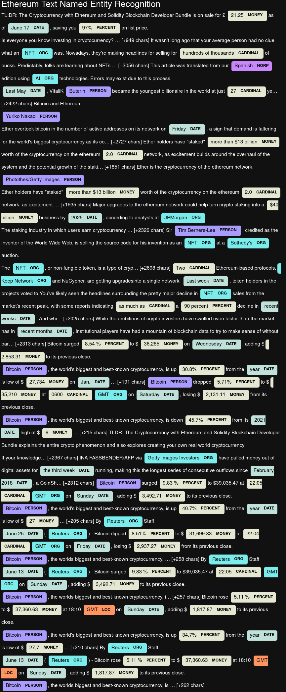

# 🐍🗣️ Tales from the Crypto 🎭🐍

1. [Sentiment Analysis](#1---Sentiment-Analysis)
2. [Natural Language Processing](#2---Natural-Language-Processing)
3. [Named Entity Recognition](#3---Named-Entity-Recognition)

---

## Files

[Starter Notebook](Code/crypto_sentiment.ipynb)

----

### 1 - Sentiment Analysis
1. Which coin had the highest mean positive score?
* Bitcoin
2. Which coin had the highest negative score?
* Bitcoin
3. Which coin had the highest positive score?
* Bitcoin

---

### 2 - Natural Language Processing

#### Bitcoin Word Cloud

#### Ethereum Word Cloud

---

### 3 - Named Entity Recognition

